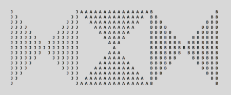

# About Me

<!-- markdownlint-disable MD033 MD013 -->

  
  

<!-- markdownlint-enable -->

- 👋 Hi, I’m **@JustABeginning**
- 👀 Interested in coding & opensource
- 🎓 A noob in Electrical Engineering
- :computer: Android Engineer, Java Developer

<!-- markdownlint-disable MD013 -->
<!---
JustABeginning/JustABeginning is a ✨ special ✨ repository because its `README.md` (this file) appears on your GitHub profile.
You can click the Preview link to take a look at your changes.
--->
<!-- markdownlint-enable -->

<!-- 

 -->

<!--  -->
